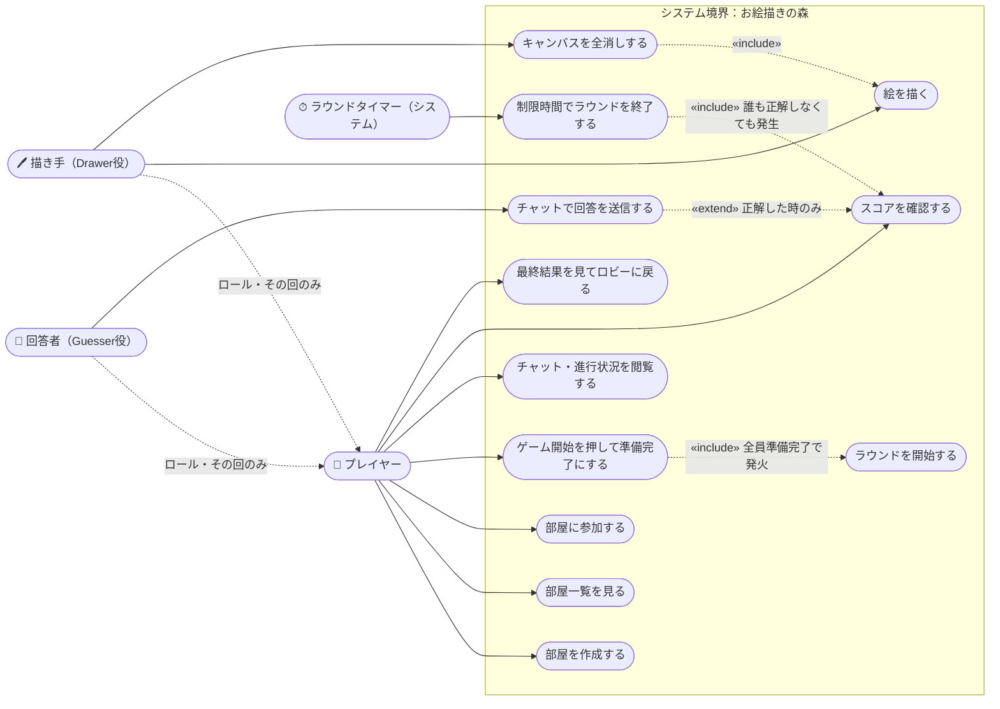
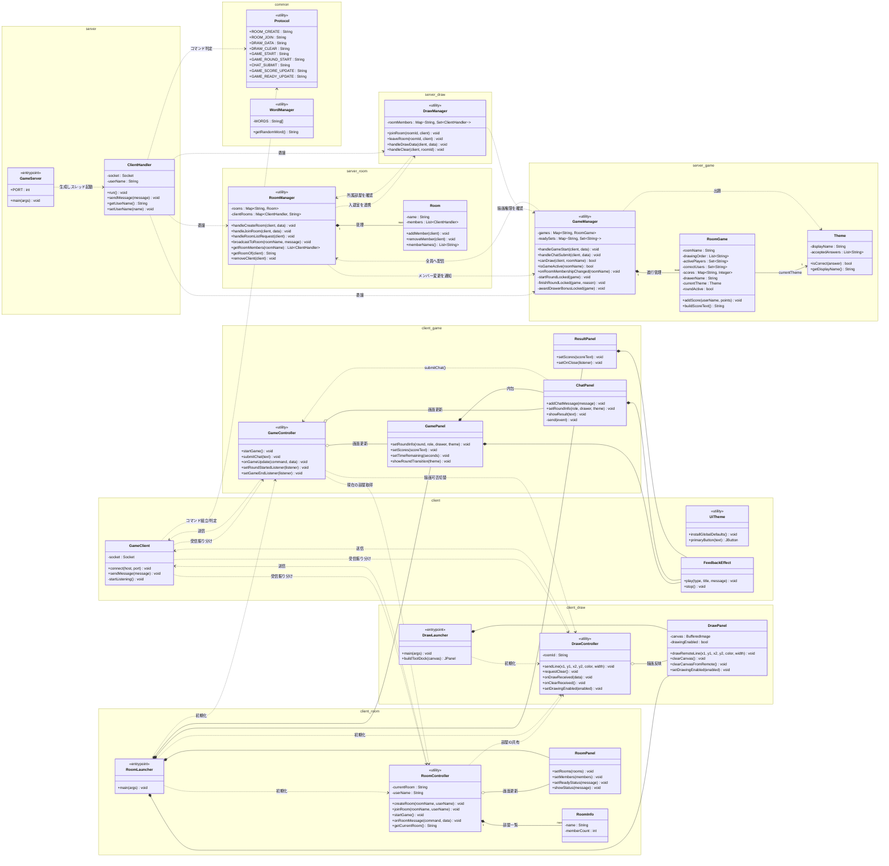
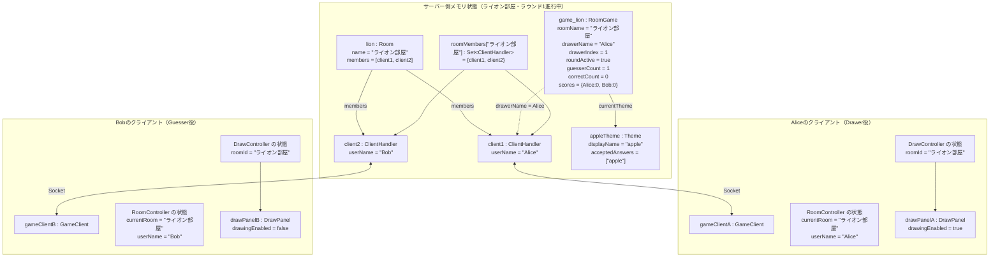
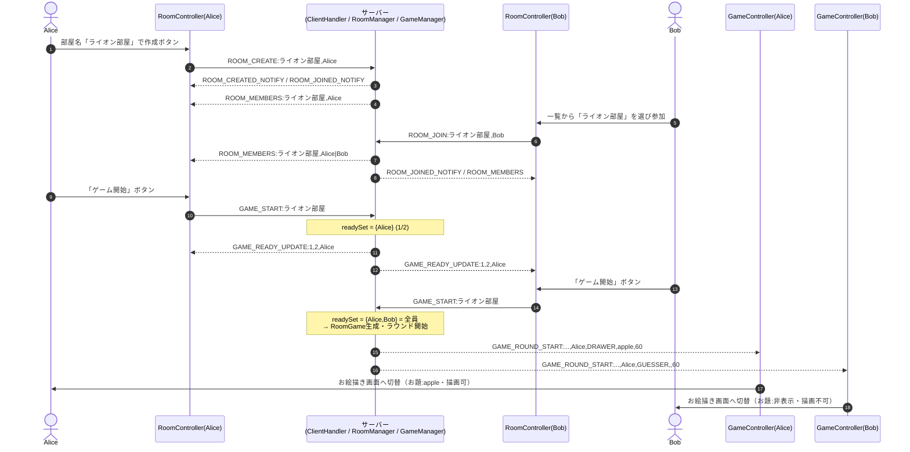
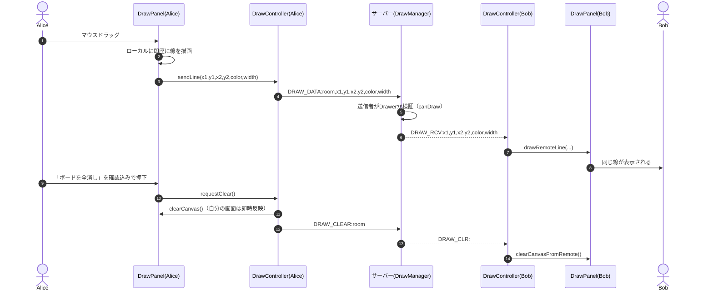

# 設計図（クラス図・オブジェクト図・ユースケース図・シーケンス図）

このドキュメントは、現在の実装（`src/` 以下、`README.md` / `PRODUCT.md` の仕様）を踏まえて、
**本来は開発着手前に作成しておくべきだった設計成果物** を事後的にまとめ直したものです。
今後の機能追加・リファクタリング時に「全体像を確認する共通の地図」として使ってください。

> Mermaidには UML の「ユースケース図」「オブジェクト図」を描く専用記法が存在しないため、
> この2つは `flowchart` 記法を使い、UMLの見た目（アクター＝棒人間アイコン、ユースケース＝角丸ノード、
> オブジェクト＝`インスタンス名 : クラス名` 表記）に寄せて表現しています。

---

## 1. ユースケース図

「誰が」「何をできるか」を、部屋管理（担当A）・お絵描き（担当B）・ゲーム進行（担当C）の3領域を横断してまとめたものです。
`描き手` `回答者` はラウンドごとにシステムが動的に割り当てる **プレイヤーの一時的な役割**（`GAME_ROUND_START` で通知される `DRAWER` / `GUESSER`）であるため、`プレイヤー` の特化として表現しています。



### 補足（実装との対応）
- `uc1〜uc3` は `Protocol.ROOM_CREATE / ROOM_JOIN / ROOM_LIST_REQUEST`、`server.room.RoomManager` に対応。
- `uc4 → uc11` は「部屋の全員が『ゲーム開始』を押すまでラウンドを始めない」という `GameManager.handleGameStart` の仕様そのもの。
- `uc5・uc6` は `GameManager.canDraw()` によって **Drawer役以外は実行できない** よう制限されている（描く権限のガード）。
- `uc7` の正誤判定は `Theme.isCorrect()`、得点計算は `GameManager.calculatePoints()`。
- `uc12` では、誰も正解しなくても描き手に加点が発生しないだけで、ラウンドは時間切れで終了する。

---

## 2. クラス図

Javaのパッケージ構成（`common` / `server.*` / `client.*`）をそのまま名前空間として使い、
クラスの責務・主要メンバー・依存関係を整理しています。`RoomManager` `DrawManager` `GameManager` `*Controller` は
すべて **static メソッドのみを持つユーティリティクラス**（インスタンス化されない、部屋やゲームの状態をクラス変数として共有する設計）です。



---

## 3. オブジェクト図

「ライオン部屋」に Alice・Bob が参加し、Alice が描き手としてラウンド1が進行中、というある瞬間のインスタンス状態のスナップショットです。
`RoomManager` `DrawManager` `RoomController` `DrawController` は static ユーティリティなので “1プロセスに1つだけ存在する状態のかたまり” として、あえてインスタンスのように図示しています。



### 補足
- `RoomManager.ensureUniqueName()` により、同名（例：初期値`Player`のまま）で入室した場合はサーバー側が `Player2` のように自動採番する。この図では既に一意な名前 `Alice` `Bob` を使っている状態。
- `DrawManager.roomMembers` は「描画データを送ってよい相手」の集合であり、`RoomManager` が持つ `Room.members`（部屋の正式メンバー）とは別に管理されている（担当A/Bの責務分離のため）。

---

## 4. シーケンス図

1本の図に全フローを詰め込むと可読性が落ちるため、代表的な3つのシナリオに分けています。

### 4-1. 部屋参加〜全員準備完了でラウンド開始



### 4-2. 描画の同期とキャンバスクリア



### 4-3. 回答〜正解判定〜ラウンド終了〜描き手への加点

```mermaid
sequenceDiagram
    autonumber
    actor Bob
    participant ChatB as ChatPanel(Bob)
    participant GC_B as GameController(Bob)
    participant Srv as サーバー(GameManager)
    participant GC_A as GameController(Alice)
    actor Alice

    Bob->>ChatB: 「apple」と入力して送信
    ChatB->>GC_B: submitChat("apple")
    GC_B->>Srv: CHAT_SUBMIT:room,apple
    Srv->>Srv: Theme.isCorrect("apple") == true
    Srv->>Srv: 得点計算 100+残り秒×10<br/>correctUsersにBobを追加
    Srv-->>GC_B: GAME_JUDGE_RESULT:CORRECT,180
    Srv-->>GC_A: GAME_SCORE_UPDATE:Alice=0;Bob=180
    Srv-->>GC_B: GAME_SCORE_UPDATE:Alice=0;Bob=180

    alt 残っていたGuesser全員が正解した
        Srv->>Srv: finishRoundLocked → awardDrawerBonusLocked(Alice)
        Srv-->>GC_A: GAME_ROUND_END:all_correct,apple
        Srv-->>GC_B: GAME_ROUND_END:all_correct,apple
        Srv-->>GC_A: GAME_SCORE_UPDATE:Alice=180;Bob=180
        Note over Srv: 3秒後、次のDrawerでラウンド再開<br/>（全員描き終えていれば代わりに GAME_END）
        Srv-->>GC_A: GAME_ROUND_START:...(次のラウンド)
        Srv-->>GC_B: GAME_ROUND_START:...(次のラウンド)
    end
```

---

## 参考にした資料

- `README.md` の「担当A/B/C/D」役割分担、通信仕様（Protocol一覧）
- `PRODUCT.md` の対象ユーザー・デザイン原則
- `src/common` `src/server` `src/client` 以下の実装（本ドキュメント作成時点の最新コード）
